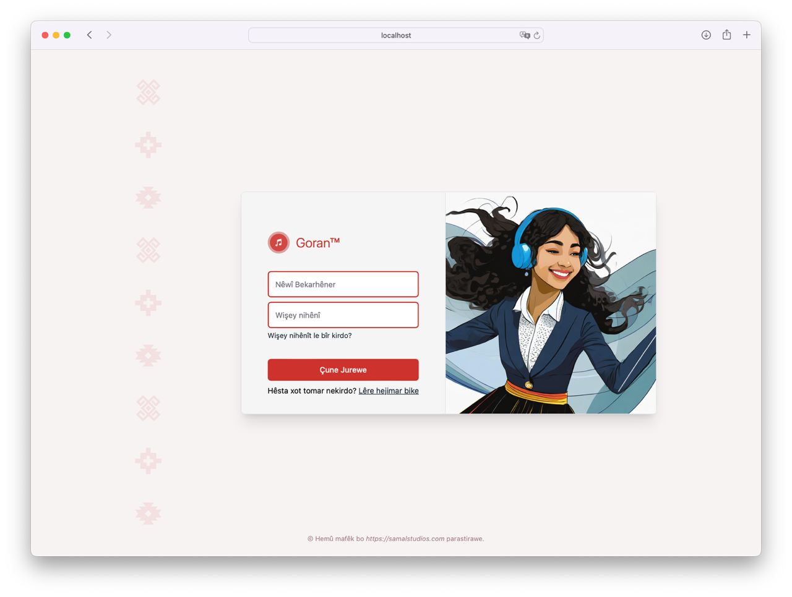
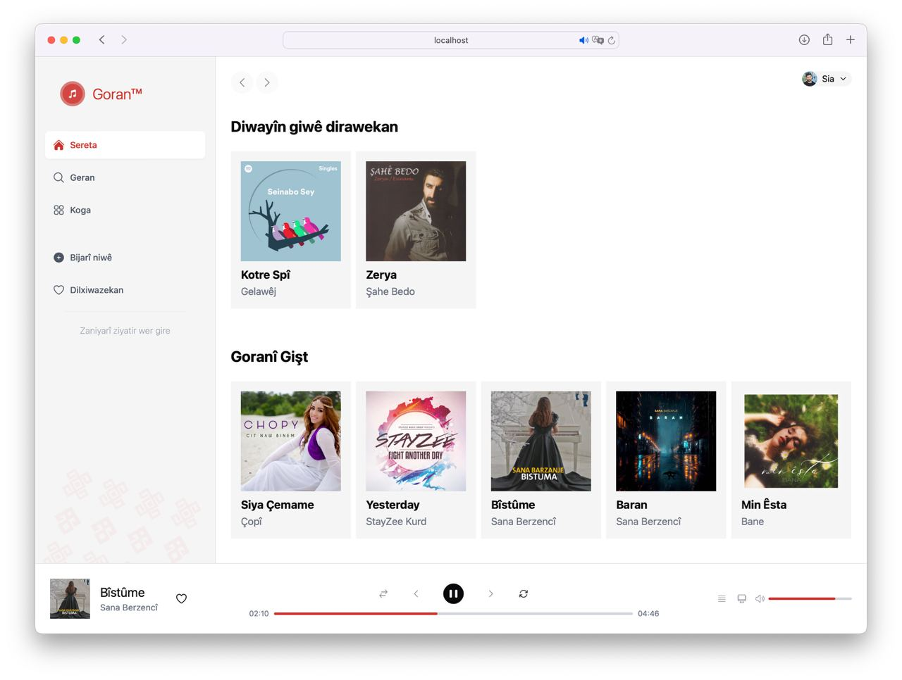

# Goran

**A Kurdish Music Streaming Service**

## Light-Mode Screenshots

**Login Page:**


**Home Page:**


## Microservices Architecture

Goran is composed of several microservices, each serving a distinct purpose within the application:

- **Gateway**: Manages and routes requests to the appropriate microservices.
- **Security**: Handles authentication and authorization.
- **File Service**: Manages music files and metadata.
- **Playlist Service**: Manages user playlists and related functionalities.
- **Web Interface**: Provides the user interface for interacting with the service.

## How to Run Locally

To run Goran locally, follow these steps:

### Prerequisites

Ensure you have the following installed:
- Docker
- Yarn
- Node.js

### Steps

1. **Start the MongoDB Database Server for the Security Service:**

   Navigate to the `security/database` directory and start the MongoDB database using Docker Compose.

   ```sh
   cd security/database
   docker-compose up

2. **Start Security Service**
Navigate to the `security` directory and start the security service.


    ```sh
    cd security/
    yarn start
    ```

3. **Start File Service**
Navigate to the `file-service` directory and start the file service.

    ```sh
    cd file-service/
    yarn start
    ```

4. **Start Playlist Service**
Navigate to the `playlist-service` directory and start the playlist service.


    ```sh
    cd playlist-service/
    yarn start
    ```

5. **Start the Web Interface**
Navigate to the `ui` directory and start the web interface.

    ```sh
    cd ui/
    yarn start
    ```

6. **Start the Gateway Service**
Navigate to the gateway directory and start the gateway service.

    ```sh
    cd gateway/
    yarn start
    ```

7. **Access the Application:**
    
    Open your web browser and navigate to http://localhost:8080
    Use `admin` for both the username and password to log in.

By following these instructions, you should be able to run the Goran music streaming service locally on your machine. Enjoy exploring Kurdish music with Goran!
