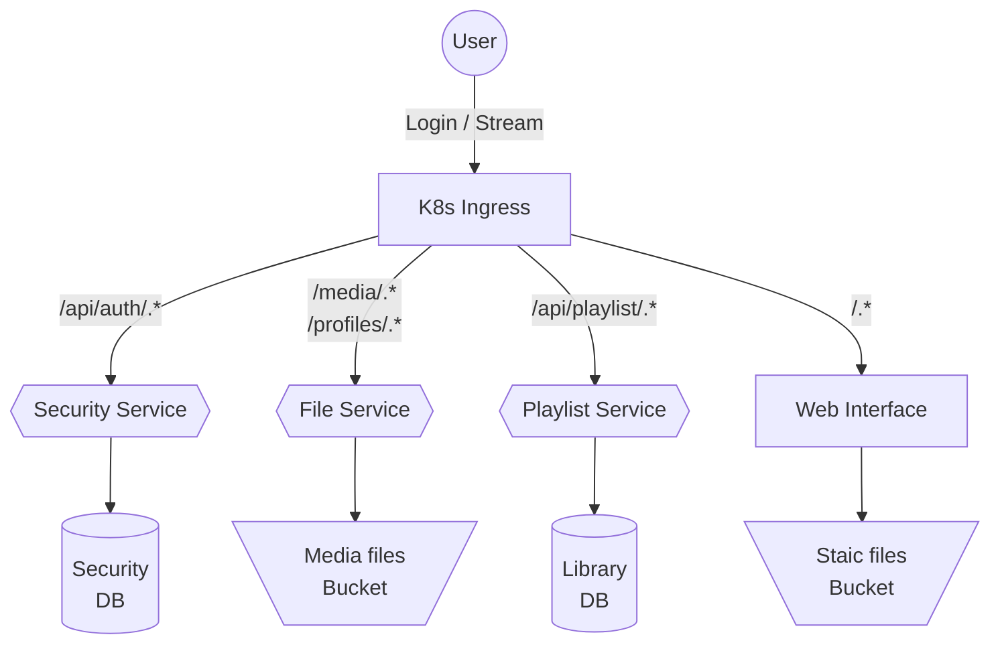

# Goran

**A Kurdish Music Streaming Service**

## Light-Mode Screenshots

**Login Page:**


**Home Page:**


## Microservices Architecture

Goran is composed of several microservices, each serving a distinct purpose within the application:

- **Gateway**: Manages and routes requests to the appropriate microservices.
- **Security**: Handles authentication and authorization.
- **File Service**: Manages music files and metadata.
- **Playlist Service**: Manages user playlists and related functionalities.
- **Web Interface**: Provides the user interface for interacting with the service.

Ideally, some of those services would be replaced (e.g. the Gatway will be replaced by k8s ingress).




## How to Run Locally

To run Goran locally, follow these steps:

### Prerequisites

Ensure you have the following installed:
- Docker & docker-compose
- Yarn / npm
- Node.js

### Steps

1. Install

   Execute the following command

   ```sh
   yarn install
   ```

2. **Start all the Services**

    Execute the following command

    ```sh
    yarn start
    ```

3. **Access the Application:**

    Open your web browser and navigate to http://localhost:8080
    Use `admin` for both the username and password to log in.

By following these instructions, you should be able to run the Goran music streaming service locally on your machine. Enjoy exploring Kurdish music with Goran!
